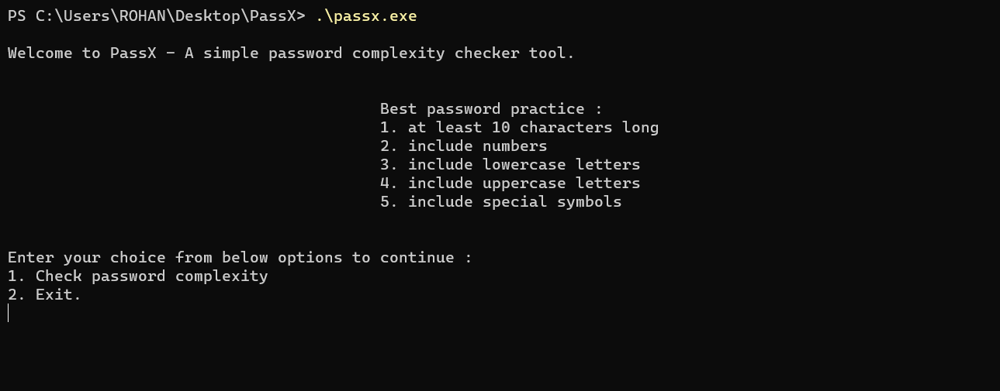

# PassX

* A simple program in C which tells password complexity, time to brute force it and strength of the password entered by the user. 

* Compile :  
  Windows : gcc PassX.c -o passx
  Linux : gcc PassX.c -o passx -lm
   
  
 *   
