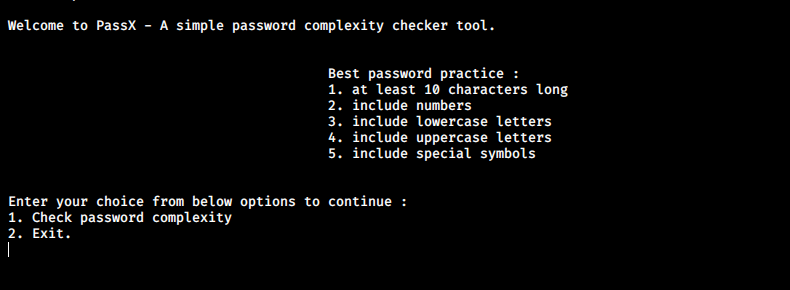

# PassX

* A simple program in C which tells password complexity, time to brute force it and strength of the password entered by the user. 

* Compile :  
  Windows : gcc PassX.c -o passx 
  Run : .\passx.exe  
   
 
    
   

* Compile and run :  
  Linux : gcc PassX.c -o passx -lm && ./passx  
  
    
   

* Wordlist : 
I have used list of 100 common passwords from SecLists. You can use any wordlist for bruteforcing. 
Note : Larger the wordlist file more time it will take to bruteforce a password.
